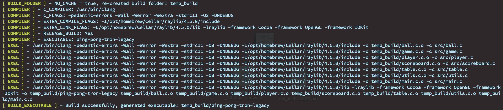
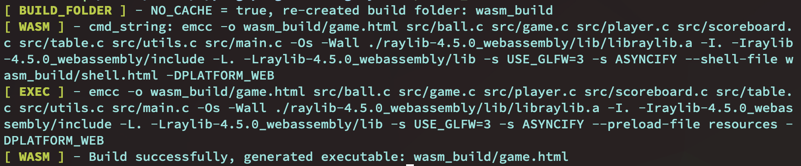
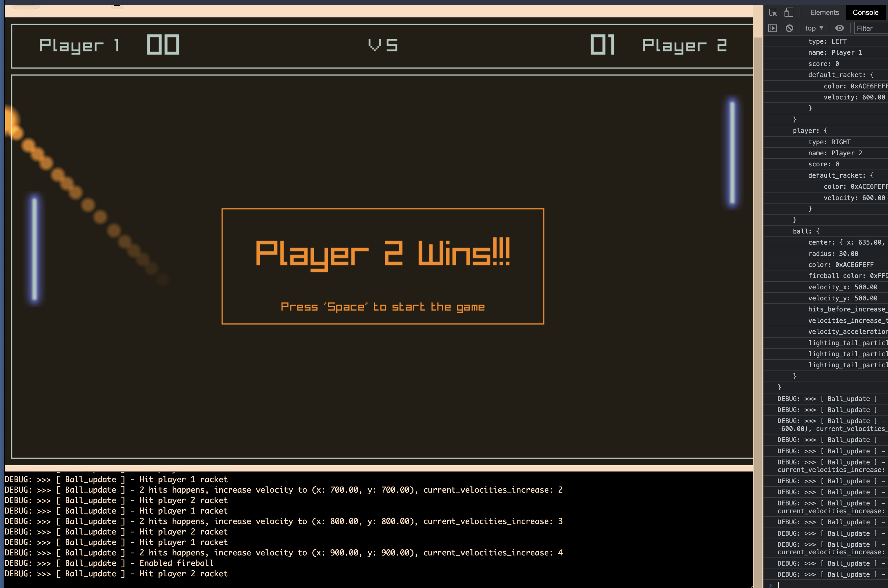

# Ping pong game TronLegacy version

Use `raylib` to reimplement my childhood favorite game, play with my kids, they
love it:)

**Make sure to enable the audio to feel the amazing sound effects:)**

https://user-images.githubusercontent.com/3477321/228088346-1d4179e2-a3f7-4826-9c7b-abb443675c45.mov

</br>

Free feel to change the default settings in [`src/config.h`](src/config.h).

Some settings you might care about when playing the game:

```c
//
// Player settings
//
#define PLAYER_1_UP_KEY KEY_E
#define PLAYER_1_DOWN_KEY KEY_D
#define PLAYER_2_UP_KEY KEY_K
#define PLAYER_2_DOWN_KEY KEY_J

//
// Ball UI settings
//
// How many hits before increasing the ball velocity
#define BALL_UI_HITS_BEFORE_INCREASE_VELOCITY 2
// How many velocities increase to enable a fireball
#define BALL_UI_VELOCITIES_INCREASE_TO_ENABLE_FIREBALL 4
// How many velocities increase to enable a lightning ball
#define BALL_UI_VELOCITIES_INCREASE_TO_ENABLE_LIGHTNING_BALL 6
// Velocity acceleration
#define BALL_UI_VELOCITY_ACCELERATION 100
```

</br>

## How to configure

This project uses my [`cbuild`](https://github.com/wisonye/cbuild) as simple
building system, that's why you don't need any extra stuff like `make/gmake/cmake`.

You just need the C compile (e.g. `cc/gcc/clang/zig cc`) and [`raylib`](https://www.raylib.com/).

- How to install `raylib` ?

    [MacOS](https://github.com/raysan5/raylib/wiki/Working-on-macOS)

    [Windows](https://github.com/raysan5/raylib/wiki/Working-on-Windows)

    [Linux](https://github.com/raysan5/raylib/wiki/Working-on-GNU-Linux)

    Or visit their [`WIKI`](https://github.com/raysan5/raylib/wiki)

    </br>


## How to build and run desktop version

- Open `cbuild.c` and replace `EXTRA_COMPILE_FLAGS` and `EXTRA_LINK_FLAGS` settings

    The default setting is for installing `raylib` over `brew install raylib` on `MacOS`.
    You need to change to yours if you're running on a different OS or use a different
    way to install `raylib`.

    For example, if you use `brew` and you got `pkg-config` installed, then you should
    run the following commands to print out the compile C flags and linking settings:

    ```bash
    # Settings for`EXTRA_COMPILE_FLAGS`
    pkg-config --cflags raylib
    # -I/opt/homebrew/Cellar/raylib/4.5.0/include

    # Settings for `EXTRA_LINK_FLAGS`
    pkg-config --libs raylib
    # -L/opt/homebrew/Cellar/raylib/4.5.0/lib -lraylib
    ```

    Use the above printout value to replace the default settings of
    `EXTRA_COMPILE_FLAGS` and `EXTRA_LINK_FLAGS` if that's not the same:

    ```c
    #define EXTRA_COMPILE_FLAGS "-I/opt/homebrew/Cellar/raylib/4.5.0/include"
    #define EXTRA_LINK_FLAGS "-L/opt/homebrew/Cellar/raylib/4.5.0/lib", "-lraylib"
    ```

    </br>

- Then build and run it

    ```bash
    # Custom player name and use stand ball radius (`30.0f`)
    PLAYER_1_NAME=Dad PLAYER_2_NAME=Mom ./run.sh

    # Use bigger ball for beginner level
    BALL_RADIUS=60.0 PLAYER_1_NAME='Ball game killer' PLAYER_2_NAME='Blow your mind' ./run.sh
    ```

    </br>

    If you don't provide the above env vars, it uses the default settings:

    ```bash
    PLAYER_1_NAME=Player 1
    PLAYER_2_NAME=Player 2
    ```

    </br>

    

    </br>

## How to build desktop version not using `cbuild`

- Dynamic link to `raylib`

    ```bash
    #
    # Use `(pkg-config --libs --cflags raylib)` to print out the C flags
    #
    clang -I/usr/local/Cellar/raylib/4.2.0/include \
        -L/usr/local/Cellar/raylib/4.2.0/lib \
        -lraylib \
        -o temp_build/my-game \
        src/utils.c \
        src/table.c \
        src/scoreboard.c \
        src/player.c \
        src/game.c \
        src/ball.c \
        src/main.c
    ```

    Confirm that's a dynamic link:

    ```bash
    otool -L temp_build/my-game

    # temp_build/my-game:
    #         /opt/homebrew/opt/raylib/lib/libraylib.420.dylib (compatibility version 420.0.0, current version 4.2.0)
    #         /usr/lib/libSystem.B.dylib (compatibility version 1.0.0, current version 1319.0.0)
    ```

    </br>


- Static link to `raylib`

    First thing first, you have to delete the dynamic lib, as `-lraylib` will
    link to dynamic lib even if the static `libraylib.a` exists!!!

    ```bash
    rm -rf /opt/homebrew/Cellar/raylib/4.5.0/lib/libraylib.420.dylib
    rm -rf /opt/homebrew/Cellar/raylib/4.5.0/lib/libraylib.dylib
    ```

    So, it should look like this (only static library exists):

    ```bash
    ls -lht /opt/homebrew/opt/raylib/lib/

    # pkgconfig/
    # cmake/
    # libraylib.a

    ls -lht /opt/homebrew/Cellar/raylib/4.5.0/lib

    # pkgconfig/
    # cmake/
    # libraylib.a
    ```

    </br>

    Now, `clang` will link to `libraylib.a`:

    ```bash
    clang -I/opt/homebrew/Cellar/raylib/4.5.0/include \
        -L/opt/homebrew/Cellar/raylib/4.5.0/lib \
        -lraylib \
        -framework Cocoa \
        -framework OpenGL \
        -framework IOKit \
        -o temp_build/my-game-static \
        src/utils.c \
        src/table.c \
        src/scoreboard.c \
        src/player.c \
        src/game.c \
        src/ball.c \
        src/main.c
    ```

    After that, run `otool` again to confirm that NO any link to `raylib`

    ```bash
    otool -L temp_build/my-game-static

    # temp_build/my-game:
    #     /System/Library/Frameworks/Cocoa.framework/Versions/A/Cocoa (compatibility version 1.0.0, current version 23.0.0)
    #     /System/Library/Frameworks/OpenGL.framework/Versions/A/OpenGL (compatibility version 1.0.0, current version 1.0.0)
    #     /System/Library/Frameworks/IOKit.framework/Versions/A/IOKit (compatibility version 1.0.0, current version 275.0.0)
    #     /usr/lib/libSystem.B.dylib (compatibility version 1.0.0, current version 1319.0.0)
    #     /System/Library/Frameworks/AppKit.framework/Versions/C/AppKit (compatibility version 45.0.0, current version 2299.30.112)
    #     /System/Library/Frameworks/CoreFoundation.framework/Versions/A/CoreFoundation (compatibility version 150.0.0, current version 1953.255.0)
    #     /System/Library/Frameworks/CoreGraphics.framework/Versions/A/CoreGraphics (compatibility version 64.0.0, current version 1690.3.3)
    #     /System/Library/Frameworks/CoreServices.framework/Versions/A/CoreServices (compatibility version 1.0.0, current version 1228.0.0)
    #     /System/Library/Frameworks/Foundation.framework/Versions/C/Foundation (compatibility version 300.0.0, current version 1953.255.0)
    #     /usr/lib/libobjc.A.dylib (compatibility version 1.0.0, current version 228.0.0)
    ```

    </br>


## How to build and run WASM version

- Install `Emscripten`

    - MacOS

        ```bash
        brew install emscripten
        ```

    - Other OS

    [`Emscripten download and install`](https://emscripten.org/docs/getting_started/downloads.html)

    </br>

- Build WASM version

    ```bash
    ./build_wasm.sh
    ```

    

    </br>

- How to run wasm version

    If you gointo the `wasm_build` folder, it should contain the following files:

    ```bash
     92K Mar 29 16:38 game.html
    192K Mar 29 16:38 game.js
    388K Mar 29 16:38 game.wasm*
    2.5M Mar 29 16:38 game.data
    ```

    </br>

    You can install any `HTTP server` program to serve that folder, for example:

    ```bash
    # For MacOS
    brew install http-server
    ```

    Then serve the folder:

    ```bash
    http-server ./

    # Starting up http-server, serving ./

    # http-server version: 14.1.1

    # http-server settings:
    # CORS: disabled
    # Cache: 3600 seconds
    # Connection Timeout: 120 seconds
    # Directory Listings: visible
    # AutoIndex: visible
    # Serve GZIP Files: false
    # Serve Brotli Files: false
    # Default File Extension: none

    # Available on:
    #   http://127.0.0.1:8080
    #   http://192.168.1.188:8080
    # Hit CTRL-C to stop the server
    ```

    </br>

    Open that url in browser then you're good to go:)

    

    </br>

